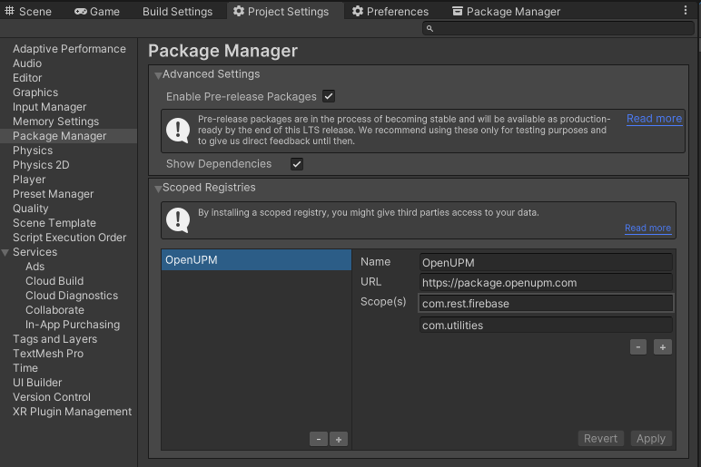

# Firebase.Realtime-Database

A non-official [Firebase](https://firebase.google.com/) RESTful Realtime-Database Client for the [Unity](https://unity.com/) Game Engine.

[](https://discord.gg/xQgMW9ufN4)
[](https://openupm.com/packages/com.rest.firebase.realtime-database/)

***All copyrights, trademarks, logos, and assets are the property of their respective owners.***

## Installing

### Via Unity Package Manager and OpenUPM

- Open your Unity project settings
- Add the OpenUPM package registry:
  - `Name: OpenUPM`
  - `URL: https://package.openupm.com`
  - `Scope(s):`
    - `com.rest.firebase`
    - `com.utilities`



- Open the Unity Package Manager window
- Change the Registry from Unity to `My Registries`
- Add the `Firebase.Realtime-Database` package

### Via Unity Package Manager and Git url

- Open your Unity Package Manager
- Add package from git url: `https://github.com/RageAgainstThePixel/com.rest.firebase.realtime-database.git#upm`
  > Note: this repo has dependencies on other repositories! You are responsible for adding these on your own.
  - [com.rest.firebase.authentication](https://github.com/RageAgainstThePixel/com.rest.firebase.authentication)
  - [com.utilities.async](https://github.com/RageAgainstThePixel/com.utilities.async)

---

## Documentation

```csharp
// Create a firebase authentication client
var authClient = new FirebaseAuthenticationClient();

// Create a firebase storage client
var dbClient = new FirebaseRealtimeDatabaseClient(authClient);

// Sign the user in
await authClient.SignInWithEmailAndPasswordAsync(email, password);

// Sets json data at the specified endpoint.
await dbClient.SetDataSnapshotAsync("test", "{\"value\":42}");

// Gets json data at the specified endpoint.
var snapshotValue = await dbClient.GetDataSnapshotAsync("test");
// snapshotValue == {"value":42}

// Deletes data at the specified endpoint.
await dbClient.DeleteDataSnapshotAsync("test");
```

## Additional Packages

- [Firebase.Authentication](https://github.com/RageAgainstThePixel/com.rest.firebase.authentication)
- [Firebase.Firestore](https://github.com/RageAgainstThePixel/com.rest.firebase.firestore)
- [Firebase.Storage](https://github.com/RageAgainstThePixel/com.rest.firebase.storage)
